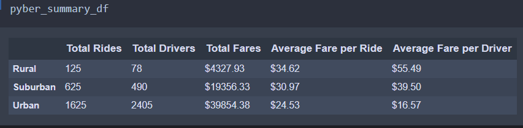
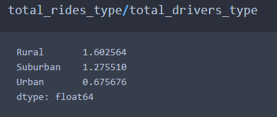

# PyBer Analysis

## Overview
As a data analyst at PyBer, a python-based ridesharing app company, we will run some exploratory analysis with some large csv files, to aid this process create some visualizations to tell a compelling story about the data. Using pandas in combination with matplotlib, we will try to understand the relationship between city type and the number of riders, drivers and fares. Lastly we will visualize the data showing the total fare by city type for all three city types (Rural, Urban, Suburban) between January to April 2019, to better understand where the best fares are in order to improve access to rideshare services and also improve affordability. 

## Results 
* Summarized ridesharing data by city type, calculating total rides, total drivers, total fares, average fare per ride and average fare ride per driver
* Found that Urban city type had the highest number of rides (1625), total drivers(2405), and total fares($39854.38), while Rural city type had the highest Average Fare per Ride($34.62) and Avergae Fare per driver($55.49)
* Observed that there is a large market gap in Suburban and Rural ridesharing market, with high fares, lesser drivers, meaning expanding access to these areas will improve ridesharing services, affordability and increase profits. 
* Visualized data by creating a line chart of total rides by city type from January to April 2019, with fares remaining constant for all city types, with sharp increase for Suburban fares and decrease in Rural fares. 

### Pyber Summary 

### Total Fares by City Type 

## Summary 
This analysis has helped Pyber better understand the disparities in ridesharing access and affordability in all three city types. We find that the company is well established in Urban areas, providing afforable rate, and access to a large number of drivers to provide rides. However, in the case of rural and specially suburban areas, there is a large gap in access and affordability. If we calculate rides per driver (total rides/total drivers), it gives us a good indication of the availability of drivers in these city types.

We find that 
